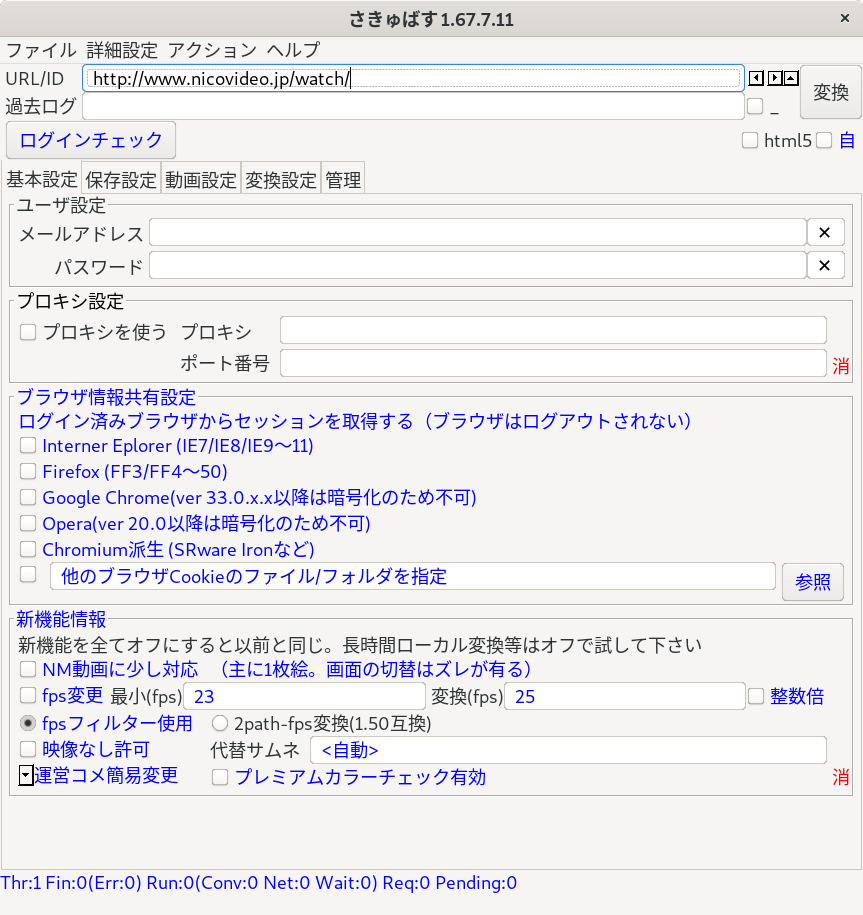

#  さきゅばすの召喚の仕方

あるいは、ビルド方法とちょっとした技術ドキュメント。

もう最後にビルドしたのが何年か前も思い出せないので、とりあえずビルドできるだけです。最後まで動くかどうかはちょっと確信がもてない。

## 開発を引き継ぎたい人へ

以下のどのチャンネルでも構わないので、ご連絡ください：

 - メール：psi < at > 7io.org
 - [7io.orgのコメント欄](https://7io.org/)
 - [このリポジトリのIssue欄](https://github.com/Saccubus/HowToSummon/issues)
 - マストドン：[@psi@sabbat.hexe.net](https://sabbat.hexe.net/psi)
 - discord: `藤咲かえで#8546`

（2chは規制で書けないことが稀によくあるのでちょっと勘弁してください）

開発を引き継ぐと次の特典がえられます：

- [github Orgnization](https://github.com/Saccubus/)の管理者権限
  - ソースコードへのコミット権限
  - 公式サイト編集権限
- [OSDNプロジェクト](https://osdn.net/projects/saccubus/)の管理者権限
  - 昔使ってて最近ほとんど使ってない。実質休眠状態です。
- github/OSDNをやめて他に行くなど

さきゅばすは基本的にGPLv3かBSD-2-Clauseでデュアルライセンスされているオープンソース・ソフトウェアですので、そこだけご注意を。

## 全体構造図

全体の構造はこんな感じです：


他にもあったかもしれないが、もう忘れた。

## ビルド方法各論

### FFmpeg

さきゅばすのffmpegは、オリジナルのffmpegにちょっとしたパッチを入れたものです。そのため自分でビルドする必要があります。

ちなみに、ffmpegのライセンスが下記の手順でビルドするとGPLv3になるので、さきゅばすはffmpegだけはGPLv3になります。

[リポジトリ](https://github.com/Saccubus/ffmpeg)

#### ソースコードのclone

```bash
git clone git@github.com:Saccubus/ffmpeg.git
cd ffmpeg
```

#### ffmpegの大本を最新版にする

まずは、ffmpegの最新版に追従させましょう。とにかくビルドだけしたい人はここは読み飛ばしてください。

```bash
# ffmpegディレクトリ下で
git checkout master

# 大本のリポジトリを追加し、情報を取得する
git remote add upstream https://git.ffmpeg.org/ffmpeg.git
git fetch upstream

# ローカルリポジトリのmasterブランチを、大本のmasterブランチに追従させる
git pull upstream master --ff-only

# https://github.com/Saccubus/ffmpeg/tree/master に反映
git push origin master
```

#### さきゅばすパッチの当たったffmpegのソースをつくる

さきゅばす用のパッチは、gitのrebaseを使って管理しています。

```bash
# Saccubus3 ブランチに移動
git checkout Saccubus3

# masterブランチからrebase
git rebase master
## この時conflictが起こったら…がんばれ。

# https://github.com/Saccubus/ffmpeg/tree/Saccubus3 にpush
# この時、--forceをつけないと親子関係がない（遠い親戚ぐらいになる）ため弾かれる。
# もしこの時の--forceで何かを壊してしまった場合、次に作るtagからリカバリしてください。
git push origin Saccubus3 --force

# 成功したら、後でトラブった時のためにtagをつけてpushしておく
git tag Saccubus3-20191109
git push origin Saccubus3-20191109
```

mergeだけでなんとかしようとした時期もあったのですが、やたらコンフリクトしてつらいのでやめました。

#### ffmpegのクロスコンパイル方法

さきゅばすのwindows用ffmpegバイナリは、クロスコンパイラを使ってLinuxから生成されています。

[リポジトリ](https://github.com/Saccubus/ffmpeg-windows-build-helpers)

##### ffmpegのクロスコンパイル・ヘルパのcloneとrebase

windows用ffmpegの全部入りバイナリを作るための[ヘルパを提供してくれる人がいる](https://github.com/rdp/ffmpeg-windows-build-helpers)ので、その人の成果に乗っかります。

具体的に言うと、ffmpegを最新版にしたのと同じことをします。

```bash
# clone
git checkout git@github.com:Saccubus/ffmpeg-windows-build-helpers.git
cd ffmpeg-windows-build-helpers

# ローカルリポジトリのmasterブランチを、大本のmasterブランチに追従させる
git remote add upstream git@github.com:rdp/ffmpeg-windows-build-helpers.gi
git checkout master
git pull upstream master --ff-only
git push origin master

# saccubus3リポジトリでrebase、push
git checkout saccubus3
git rebase master

git push origin saccubus3 --force

# 後のために一応タグをつけて保存
git tag saccubus3-20191109
git push origin saccubus3-20191109
```

##### ヘルパを使ってクロスコンパイルする

やっとこれでビルドが出来ます。

```bash
# ffmpeg-windows-build-helpersのディレクトリで
git checkout saccubus3
bash compile_saccubus.sh
```

二時間ぐらい掛かるかな。

うまくいくと、`sandbox/win64/ffmpeg_git/`の下にffmpegが出来上がるはずです。

### フロントエンド

いわゆるGUI部分です。

[OpenJDKの最新版](https://www.google.com/search?client=ubuntu&channel=fs&q=openjdk+%E5%85%A5%E3%82%8C%E6%96%B9&ie=utf-8&oe=utf-8)をとりあえず入れておいてください。

[リポジトリ](https://github.com/Saccubus/Saccubus3/tree/master/frontend)

```bash
git checkout git@github.com:Saccubus/Saccubus3.git
cd Saccubus3/frontend

# とりあえず起動したい
./gradlew run

# jarを作りたい
./gradlew build
java -jar build/libs/jp.osdn.saccubus-3.0-all.jar
```

他の`./gradlew`のコマンドに関しては[公式サイト](https://docs.gradle.org/current/userguide/userguide.html)を見てください。

あと開発には[IntelliJ Idea](https://www.jetbrains.com/idea/)が使えます。



### nicovideo(E).dll

### (おまけ) saccubus.osdn.jp

[さきゅばす公式サイト](https://saccubus.github.io/)も[github pages](https://github.com/Saccubus/saccubus.github.io)
で管理しています。
